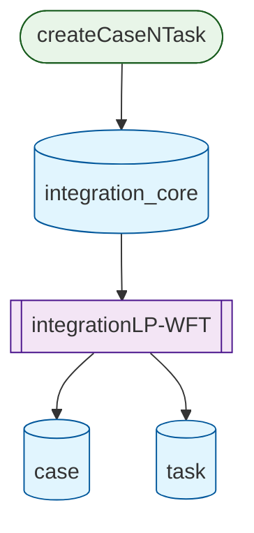

# Mermaid.js Flowchart Integration Plan

Add Mermaid.js flowchart generation to the existing database flow visualization Express application, providing a standardized, professional diagram format that clearly distinguishes between databases and flows.

## Overview
Extend the existing application to generate Mermaid.js flowcharts from the database flow hierarchy, providing a toggleable Mermaid View alongside the existing Tree View and Step-by-Step View. The flowcharts will use appropriate shapes and styling to clearly differentiate database nodes from flow nodes.

## Types
Extend existing interfaces to support Mermaid.js generation.

```typescript
interface MermaidConfig {
  theme: 'default' | 'forest' | 'dark' | 'neutral';
  flowchart: {
    useMaxWidth: boolean;
    htmlLabels: boolean;
  };
}

interface MermaidFlowchart {
  mermaidCode: string;
  config: MermaidConfig;
  nodeCount: number;
  edgeCount: number;
}
```

## Files
**New Files:**
- `utils/mermaidGenerator.js` - Mermaid.js flowchart generation logic
- `public/mermaid-view.html` - Mermaid.js rendering interface (optional, can be integrated into existing HTML)

**Modified Files:**
- `public/app.js` - Add Mermaid.js view toggle and rendering
- `public/styles.css` - Add Mermaid.js container styling
- `routes/flows.js` - Add Mermaid.js generation endpoint
- `public/index.html` - Add Mermaid.js library CDN and view toggle

## Functions
**New Functions:**
- `generateMermaidFlowchart(hierarchy)` - Converts flow hierarchy to Mermaid.js syntax
- `createDatabaseNode(tableName)` - Creates Mermaid.js database-shaped node
- `createFlowNode(flow)` - Creates Mermaid.js process-shaped node for flows
- `createFlowEdges(flow, level)` - Creates connections between nodes
- `renderMermaidView(mermaidCode)` - Client-side Mermaid.js rendering
- `toggleMermaidView()` - Switch to Mermaid.js visualization

**Modified Functions:**
- `toggleViewMode()` - Add Mermaid.js as third view option
- `FlowVisualizer.renderTreeView()` - Add Mermaid.js view integration

## Classes
**New Classes:**
- `MermaidGenerator` - Server-side Mermaid.js code generation
  - `constructor(flowData)`
  - `generateFlowchart(hierarchy)`
  - `applyStylingClasses()`

**Modified Classes:**
- `FlowVisualizer` - Add Mermaid.js rendering capability
  - `renderMermaidView(hierarchy)`

## Dependencies
**New Dependencies:**
- `mermaid` - Mermaid.js library (client-side via CDN)
- No additional server dependencies needed

**Integration Requirements:**
- Load Mermaid.js from CDN in HTML
- Initialize Mermaid.js on client-side
- Add Mermaid.js container to existing UI

## Testing
**Test Scenarios:**
- Mermaid.js syntax generation for single flow
- Multi-level hierarchy conversion to Mermaid
- Database vs flow node shape differentiation
- Edge connection syntax validation
- Client-side Mermaid.js rendering

**Validation Strategies:**
- Verify generated Mermaid.js code is syntactically correct
- Test rendering in Mermaid.js live editor
- Ensure proper node shapes for databases (cylinders) vs flows (rectangles)
- Validate edge connections match flow hierarchy

## Implementation Order
1. **Research & Planning** - Understand Mermaid.js syntax and capabilities ✓
2. **Server-Side Generation** - Implement Mermaid.js code generation
3. **API Endpoint** - Add Mermaid.js generation endpoint
4. **Client Integration** - Add Mermaid.js view toggle and rendering
5. **Styling & Polish** - Apply consistent theming and styling
6. **Testing & Validation** - Verify Mermaid.js rendering works correctly

## Mermaid.js Implementation Details

### Node Shapes
- **Database Nodes**: Use cylinder shape `[(Database Name)]`
- **Flow Nodes**: Use rectangle shape `[Flow Name]` or subroutine shape `[[Flow Name]]`
- **Manual Trigger Nodes**: Use stadium shape `([Manual Flow])`

### Styling Strategy
- Apply CSS classes for consistent theming
- Use different colors for databases vs flows
- Add descriptive labels showing trigger types and actions

### Example Output Structure


This implementation will provide a professional, standardized visualization format that clearly communicates the database flow relationships.
